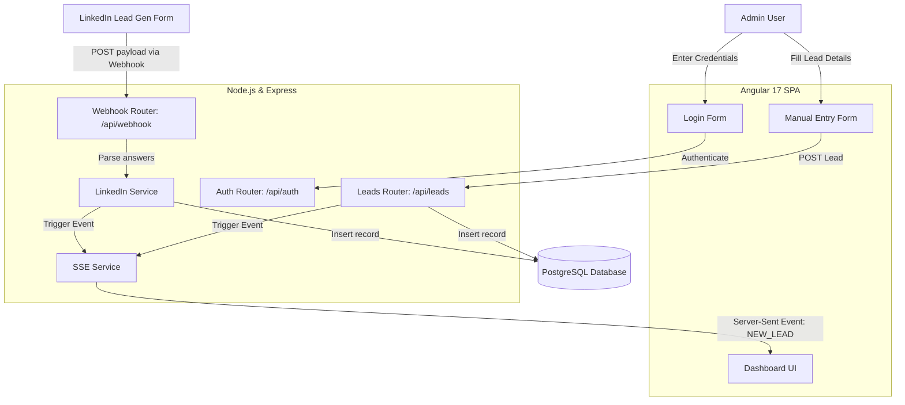

# Internship Project Documentation

## Overview
The **Internship Project** is a full-stack web application designed as a comprehensive lead management system. It allows administrators to track, manage, and receive real-time updates for leads coming from various sources, most notably through an integrated LinkedIn webhook. 

The application features a modern Single Page Application (SPA) frontend built with Angular, a robust RESTful API backend built with Node.js and Express, and a relational PostgreSQL database for reliable data storage.

---

## Architecture Visuals

### 1. Project Architecture
This image provides a high-level view of the application's structure.

### 2. System Flow Diagram
The following flowchart illustrates the data flow, specifically focusing on how LinkedIn leads are captured, processed, and pushed to the frontend in real-time using Server-Sent Events (SSE).

---

## Technical Stack & Components

### Frontend (Angular 17)
- **Framework**: Angular 17 SPA architecture.
- **Components**:
  - `dashboard`: Displays the real-time list of leads.
  - `login`: Admin authentication portal.
  - `add-employee` & `verify-employee`: Interface for manual data entry and verification.
- **Services**:
  - `lead.service.ts`: Handles standard HTTP REST API communication with the backend.
  - `notification.service.ts`: Manages the SSE connection to receive real-time lead updates.

### Backend (Node.js + Express)
- **Server Configuration** (`index.js`): Exposes API routes and configures CORS/JSON parsing.
- **Database Connection** (`db.js`): Uses the `pg` library to maintain a connection pool to PostgreSQL.
- **Core Routes**:
  - `auth.js`: Handles admin login credentials.
  - `leads.js`: Standard CRUD operations for leads and provides the `/stream` endpoint for SSE connections.
  - `webhooks.js`: Handles the LinkedIn verification challenge (GET) and processes incoming lead data (POST).
- **Core Services**:
  - `linkedin.service.js`: Extracts actual user details (Name, Email, Phone, Company) from the nested LinkedIn webhook `formResponse.answers` payload.
  - `sse.service.js`: Manages active connections to the Angular frontend and broadcasts events (like `NEW_LEAD`, `UPDATE_LEAD`, `DELETE_LEAD`).

### Database (PostgreSQL)
- **Table Structure**: The `leads` table (formerly `employees`) stores standard information such as `name`, `email`, `department`, `status`, `source`, `company`, `notes`, `linkedin_id`, and `created_at`.